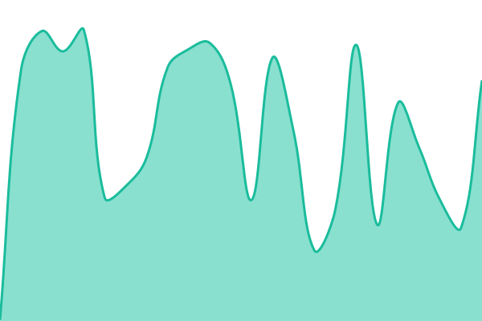
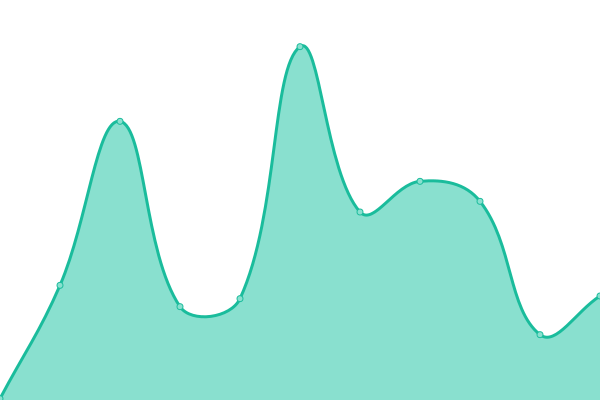
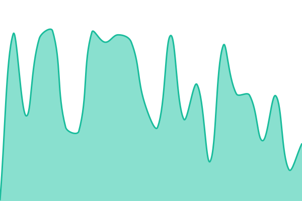

# [📈 Live Status](https://status.threatvec.com): <!--live status--> **🟥 Complete outage**

This repository contains the open-source uptime monitor and status page for [John McKinley](https://status.threatvec.com), powered by [Upptime](https://github.com/upptime/upptime).

With [Upptime](https://upptime.js.org), you can get your own unlimited and free uptime monitor and status page, powered entirely by a GitHub repository. We use [Issues](https://github.com/jmckinley/threatvec-status/issues) as incident reports, [Actions](https://github.com/jmckinley/threatvec-status/actions) as uptime monitors, and [Pages](https://status.threatvec.com) for the status page.

<!--start: status pages-->
<!-- This summary is generated by Upptime (https://github.com/upptime/upptime) -->
<!-- Do not edit this manually, your changes will be overwritten -->
<!-- prettier-ignore -->
| URL | Status | History | Response Time | Uptime |
| --- | ------ | ------- | ------------- | ------ |
|  [ThreatVec Platform](https://app.threatvec.com/healthz) | 🟥 Down | [threat-vec-platform.yml](https://github.com/jmckinley/threatvec-status/commits/HEAD/history/threat-vec-platform.yml) | 

 2044ms
     
 | 

<a href="https://status.threatvec.com/history/threat-vec-platform">92.01%</a>
    

|  [ThreatVec Dashboard](https://app.threatvec.com/status) | 🟥 Down | [threat-vec-dashboard.yml](https://github.com/jmckinley/threatvec-status/commits/HEAD/history/threat-vec-dashboard.yml) | 

 203ms
     
 | 

<a href="https://status.threatvec.com/history/threat-vec-dashboard">93.76%</a>
    

|  [ThreatVec MCP Server](https://app.threatvec.com/mcp/info) | 🟥 Down | [threat-vec-mcp-server.yml](https://github.com/jmckinley/threatvec-status/commits/HEAD/history/threat-vec-mcp-server.yml) | 

 226ms
     
 | 

<a href="https://status.threatvec.com/history/threat-vec-mcp-server">95.60%</a>
    

|  [ThreatVec API Docs](https://app.threatvec.com/docs) | 🟥 Down | [threat-vec-api-docs.yml](https://github.com/jmckinley/threatvec-status/commits/HEAD/history/threat-vec-api-docs.yml) | 

 187ms
     
 | 

<a href="https://status.threatvec.com/history/threat-vec-api-docs">97.00%</a>
    

<!--end: status pages-->

[**Visit our status website →**](https://status.threatvec.com)

## 📄 License

- Powered by: [Upptime](https://github.com/upptime/upptime)
- Code: [MIT](./LICENSE) © [Anand Chowdhary](https://anandchowdhary.com), supported by [Pabio](https://pabio.com)
- Data in the `./history` directory: [Open Database License](https://opendatacommons.org/licenses/odbl/1-0/)
